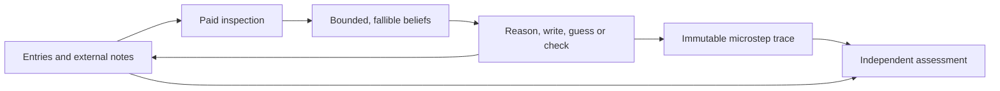

# Modelling a human Sudoku solver

[human-solving.allium](../specs/human-solving.allium) specifies a person attempting a
fresh Sudoku and an assessment of that puzzle for a particular profile. An attempt
records what the person inspects, remembers, tries, misses, writes and corrects.
Repeating it with declared seeds produces solve counts and effort distributions.
These specifications define future simulator behaviour; this change does not supply
an executable simulator or a new game surface.

The [strategy survey](solving-sudoku.md), originally requested as
`docs/scratch/solving_sudoku.md`, supplies background.
[technique.allium](../specs/technique.allium) owns the precise logical catalogue.
This page owns the rationale, evidence limits, tuning guide and route from those
contracts to validation. The Allium clauses remain authoritative.

## Four comparisons, one logical catalogue

| Model | What a limitation does | Appropriate interpretation |
| --- | --- | --- |
| [Reach](../specs/reach.allium) | Hides deductions outside the profile. | How far a deterministic, error-free player can get; a possible next hint. |
| [Effort](../specs/effort.allium) | Makes a deduction more expensive; permits explicit escalation. | A coarse price, with its existing numerical questions still open. |
| [Lapse](../specs/lapse.allium) | Lets candidates become stale, eventually prompting a guess. | A coarse comparison with perfect initial candidates and deterministic behaviour. |
| [Human solving](../specs/human-solving.allium) | Changes observation, retention, reasoning, confidence and recovery. | A distribution of fallible attempts under stated conditions. |

The three baseline models keep their existing profile and assumptions. The richer
model has its own profile: experience need not imply greater cognitive capacity,
and an expert need not notice every available move. Extending the shared catalogue
can change the baseline models' results, but does not give them the richer model's
attention or error mechanisms. Rating runs supply an explicit uniqueness premise;
unverified hint grids do not.

## What is known, believed and independently judged

The physical sheet contains the givens, actual entries and external notes. The
mental state contains only acquired beliefs and bounded working material. The
observer can reconstruct the entire trace and compare it with the solution.

There is no observer-to-policy connection. A configured solution-check aid is a
separate, explicit exception to ordinary board information: the person pays to ask
whether an entry is wrong, and the aid does not reveal the right digit. With the
default paper environment that aid is absent.

This separation matters even for simple moves. A written 4 in an otherwise
unmarked cell is a partial note. It does not establish that 4 is the only candidate.
A person might mistakenly treat it that way; the model records the faulty inference,
its consequences and any later detection. If 4 happens to be right, that does not
turn the reasoning into a valid naked single.

## Research and the claims it supports

The mechanisms below are research-informed hypotheses. Every numerical preset,
per-action cost, probability law and effect size in this specification is a
provisional modelling choice. None is an estimated population parameter.

| Evidence | What it motivates here | What it does not establish |
| --- | --- | --- |
| [Cowan, 2001](https://pubmed.ncbi.nlm.nih.gov/11515286/) | A small working-memory capacity measured in chunks, with attention, rehearsal and grouping affecting what can be retained. | A universal four-item limit, a mapping from one cell to one chunk, or capacities for named player levels. |
| [Leu, Tang and Abbass, 2018](https://arxiv.org/abs/1802.10079) | Explicit storage/processing constraints in computational Sudoku agents. | Human calibration of this simulator. Their no-note setting is a particular experimental design, not the required environment here. |
| [Risko and Dunn, 2015](https://doi.org/10.1016/j.concog.2015.05.014) | Treating external memory use as behaviour influenced by task demands and metacognition. | Free, perfectly maintained notes or a Sudoku-specific note-use probability. |
| [Bilalić, McLeod and Gobet, 2008](https://pubmed.ncbi.nlm.nih.gov/18565505/) | Testing familiar-solution fixation and its effect on search. The study concerns chess; applying the mechanism to Sudoku is a transfer assumption. | The area, digit or method weights used here. |
| [Wason, 1960](https://doi.org/10.1080/17470216008416717) | Distinguishing seeking confirming evidence from testing an opposing possibility. | A general probability of confirmation bias or a measured Sudoku effect. |
| [Ackerman, 2014](https://pubmed.ncbi.nlm.nih.gov/24364687/) | Making confidence and stopping criteria explicit rather than equating confidence with correctness. | The proposed fatigue, frustration, recovery or verification formulas. |
| [Pelánek, 2014](https://arxiv.org/abs/1403.7373) | Assessing both reasoning demands and dependencies among solution steps, using human-solving data to evaluate difficulty models. | Validation of the current error mechanisms, presets or a conversion from effort to minutes. |

Memory retention, interference and fatigue are deliberately separate. The same
retained content may fit within capacity yet decay during a long search. Conversely,
rehearsal can preserve a small set while consuming effort that could have gone into
looking elsewhere. These are testable design hypotheses, not diagnoses of an individual.

## Parameters and their units

The tables explain the defaults in the specification. All probability fields range
from 0 to 1 inclusive. Integer limits are finite; invalid values are rejected.
Changes affect their named mechanism, not a global skill multiplier.

### Cognitive ability

All four experience presets use `standard_ability` unchanged.

| Field | Default | Allowed range and unit | Effect when increased |
| --- | --- | --- | --- |
| `capacity` | 4 | 1–12 simultaneous chunks | More live facts, pending reasoning and unwritten branch information can coexist. |
| `retention` | 12 | 1–1000 microsteps since refresh | A retained item survives longer without rehearsal. |
| `interference` | 0.02 | Probability per retained item on focus change | More content is lost when attention switches. |
| `attention_cells` | 3 | 1–9 focused positions | More positions can be inspected before another focus change. Each fact still requires its own inspection. |
| `switch_effort` | 2 | 0–20 effort units | Moving focus or changing the selected digit costs more. |
| `reasoning_depth` | 8 | 0–24 implications per episode | Longer elementary derivations become possible; zero disables their implication steps. |
| `notice` | 0.90 | Probability per inspected fact | More requested facts are noticed; it also supplies initial perceived confidence. |
| `perception_error` | 0.01 | Probability per noticed fact | More facts are misread. |
| `inference_error` | 0.01 | Probability per attempted inference | More premise, digit or target mistakes occur. |
| `entry_error` | 0.005 | Probability per physical edit | More entries, erasures and note edits differ from their intention. |

Capacity counts chunks, not cells. A raw atomic fact occupies one chunk. A learned
chunk has explicitly bounded contents and a recognized pattern; it cannot encode
the whole puzzle under a convenient name. Every needed premise must remain available
when an inference uses it. A trace available to the observer is not external memory
available to the person.

Familiar fragments, such as a checked bivalue cell or a witnessed link, can be
grouped through paid recognition before the person attempts a larger pattern.
This lets expertise improve organization without requiring all raw facts of a
large pattern to fit first. Grouping and any later unpacking still obey capacity.

Fatigue reduces noticing and recognition through division by `1 + fatigue`.
It increases each applicable error/interference probability by multiplication by
`1 + fatigue`, capped at 1. A zero error rate stays zero. Retention expiry and
capacity eviction remain possible even when stochastic error rates are zero.

### Experience and learned methods

`Experience.familiar` names methods with a recognition shortcut. Its common
`fluency`, `chunk_facts` and `habit` values can be overridden independently for
each familiar method using `Skill`. Fluency is a probability, chunk size is an
integer from 1 to 12, and habit is a relative weight from 0.1 to 10.

| Preset | Familiar methods | Fluency | Facts per learned chunk | Habit |
| --- | --- | --- | --- | --- |
| Rules-only novice | None; the Sudoku rules and bounded elementary reasoning are available. | 0.00 | 1 | 1.0 |
| Practised beginner | Full unit, cross-hatch, naked single, hidden single. | 0.55 | 2 | 1.0 |
| Intermediate | Beginner methods, pointing, claiming, naked/hidden pairs and triples, X-Wing. | 0.75 | 3 | 1.0 |
| Expert | All 29 supported catalogue methods. | 0.95 | 4 | 1.0 |

A novice is likely to inspect individual cells, count missing digits, cross-check
peers, make partial notes and revisit familiar areas. A practised beginner can
recognize singles from acquired premises. The expert can search for named patterns
and organize acquired information into learned chunks. Neither starts with the
answer or with free complete candidates.

An unfamiliar method can be derived from elementary implications within the
person's memory, depth and effort limits. Observer classification may call the
completed proof an X-Wing, for example, even though the person did not recognize
that name. The attempt does not teach the method for later moves or later puzzles.

### Biases and action choice

| Field | Default | Allowed range and unit | Effect |
| --- | --- | --- | --- |
| `area_fixation` | 0.5 | 0–10 extra relative weight | Favours the current focus. |
| `digit_fixation` | 0.3 | 0–10 extra relative weight | Favours continuing with the selected digit. |
| `familiar_preference` | 2.0 | 0–10 extra weight multiplied by fluency | Favours trying known methods. |
| `confirmation` | 0.10 | Probability per selected opposing-evidence check | The person may skip the check, still spending effort. |
| `overconfidence` | 0.05 | 0–1 confidence increment | Raises subjective confidence and lowers the probability of verification. |

Choice is among locally eligible actions, not among an oracle's available
deductions. The exact weight and sampling rules are in `ChoiceAndBias`.
Setting these fields to zero removes these biases while leaving imperfect noticing
and other stochastic mechanisms intact.

### Coping and changes during an attempt

| Field | Default | Allowed range and unit | Effect |
| --- | --- | --- | --- |
| `note_use` | 0.70 | Probability when externalization is possible | Tendency to write an acquired fact down. |
| `verification` | 0.35 | Probability before commitment | Tendency to begin a paid verification episode. |
| `confidence_threshold` | 0.80 | 0–1 subjective confidence | Minimum confidence for a proposed logical entry. |
| `guess_when_stuck` | 0.25 | Probability at the patience limit | Tendency to branch when no usable conclusion has been found. |
| `guess_depth` | 2 | 0–9 standing branches | Maximum nested speculative choices. Zero disables guessing. |
| `guess_limit` | 12 | 0–100 guesses per attempt | Bounds repeated branch opening even after backtracking. |
| `branch_recall` | 0.80 | Probability per unwritten change recalled | Chance of reconstructing that change correctly during recovery. |
| `patience` | 24 | 1–1000 consecutive fruitless episodes | Search tolerance before guessing, resting or giving up. |
| `rest_limit` | 2 | 0–100 rests | Number of permitted recovery breaks. |
| `fatigue_gain` | 0.0002 | 0–1 fatigue per non-rest effort unit | Growth of fatigue, capped at 1. |
| `frustration_gain` | 0.03 | 0–1 per fruitless episode or noticed error | Growth of frustration, capped at 1. |
| `progress_relief` | 0.15 | 0–1 frustration per perceived advance | Relief after progress the person believes they made. |
| `rest_relief` | 0.25 | 0–1 fatigue and frustration per rest | Recovery from a break; it does not refund effort or restore forgotten facts. |

Frustration reduces effective patience to
`max(1, ceil(patience × (1 − frustration / 2)))`.
Fatigue and frustration start at zero. Setting their gains to zero keeps them
absent. Experience is fixed for the whole attempt.

Contradictions are discovered through inspections, reasoning or a configured aid.
The observer does not announce them. Recovery can miss a dependent error or fail to
reconstruct an unwritten branch. Correctly guessing a digit remains guessing.

### Environment and accounting

| Setting | Default | Alternatives and meaning |
| --- | --- | --- |
| Manual notes | On | Off forbids writing candidate and coverage notes. |
| Automatic candidates | Off | On supplies locally allowed candidates from current entries, including the consequences of wrong entries. |
| Highlighting | Off | Peers, selected digit, or both; no logical hint. |
| Feedback | None | Conflicts, or a queried entry's disagreement with the solution. |
| Uniqueness disclosed | On | Off denies the player the premise needed by the two uniqueness methods. |
| Branch notes | On | Off requires bounded mental branch tracking; on requires manual notes. |

Aids affect which information can be obtained. Reading that information still
costs effort. Manual notes can be incomplete, stale or wrong; automatic candidate
display is separate from them.

| Cost or bound | Default | Allowed range and unit |
| --- | --- | --- |
| Read, recall, rehearse, attend | 1 | 1–100 effort units per action; an actual focus change adds `switch_effort`. |
| Recognize, infer, verify | 2 | 1–100 effort units per action. |
| One entry, erasure or note edit | 1 | 1–100 effort units per action. |
| Rest | 5 | 1–100 effort units per rest. |
| Declare completion or give up | 1 | 1–100 effort units. |
| Total effort | 5000 | 1–1000000 effort units per attempt. |
| Microsteps | 10000 | 1–1000000 completed actions per attempt. |
| Catalogue chain limit | 24 | Links per catalogue proof path; distinct from the profile's smaller reasoning bound. |
| Catalogue forcing-path limit | 9 | Paths in a bounded forcing proof. |
| Assessment size | Declared by caller | 1–10000 seed occurrences. |
| Seed | Declared by caller | Integer from 0 to 2147483647 inclusive. |

A guess costs one thought plus one write. Backtracking pays for recalling one
change, then separately for each actual edit. Failed recognition, repeated
inspection and skipped verification consume effort too. The resulting total is
not a prediction of elapsed time.

The initial version identifiers are `human-solving-1`, `technique-2` and
`lcg32-1`. The specification pins the seed-to-draw mapping, draw order and
sampling conventions. The simple initial stream is a reproducibility convention,
not evidence that the simulation's output probabilities match human behaviour.

## Named technique coverage

The shared catalogue defines the supporting facts, permitted result and proof
obligations for each supported method. The names below link to the author's
HoDoKu technique reference used to check nomenclature and variants; the normative
definitions and independently constructed acceptance schemas live in
[technique.allium](../specs/technique.allium).

| Group | Supported names |
| --- | --- |
| [Singles](https://hodoku.sourceforge.net/en/tech_singles.php) | Full unit, cross-hatch, naked single, hidden single. Full unit corresponds to “Full House”; cross-hatching is the by-sight search for a forced position. |
| [Intersections](https://hodoku.sourceforge.net/en/tech_intersections.php) | Pointing, claiming. |
| [Naked subsets](https://hodoku.sourceforge.net/en/tech_naked.php) and [hidden subsets](https://hodoku.sourceforge.net/en/tech_hidden.php) | Pairs, triples and quads of each kind. |
| [Basic fish](https://hodoku.sourceforge.net/en/tech_fishb.php) | X-Wing, Swordfish, Jellyfish. |
| [Wings](https://hodoku.sourceforge.net/en/tech_wings.php) | XY-Wing, XYZ-Wing, W-Wing. |
| [Single-digit patterns](https://hodoku.sourceforge.net/en/tech_sdp.php) | Skyscraper, Two-String Kite, Empty Rectangle. |
| [Colouring](https://hodoku.sourceforge.net/en/tech_col.php) | Simple colouring, with colour wrap and colour trap. |
| [Chains](https://hodoku.sourceforge.net/en/tech_chains.php) | Remote Pair, X-Chain, XY-Chain, Alternating Inference Chain. |
| [Forcing](https://hodoku.sourceforge.net/en/tech_last.php) | Bounded forcing chains, including contradiction and exhaustive-case common conclusions. |
| [Uniqueness](https://hodoku.sourceforge.net/en/tech_ur.php) | Unique Rectangle Type 1 and BUG+1, each with the explicit uniqueness premise. |

The catalogue admits basic row/column fish and single-candidate chain nodes.
Finned and sashimi fish, general grouped chains, almost locked sets, forcing nets,
other uniqueness variants and unrestricted Nishio are deferred. An unfinished
bounded proof has no deduction. Committing a speculative digit creates a guess
event, even if the same conclusion could eventually have been proved.

Scanning is a search activity, not a logical deduction. The trace records the
inspections; a successful result receives its actual technique name. A proof
matching several names retains those matches but counts one applied move.

## What an assessment returns

Each attempt retains its complete effective inputs, versions, seed, stopping
reason, final sheet, mental state, observer judgement and microstep trace.
The observer distinguishes sound reasoning, false premises, physical slips and
correct results reached by luck.

An assessment runs exactly the caller's ordered seed list against one fixed
condition. Repeated seeds remain visible as repetitions. It reports:

- Objective solve count, total run count and their fraction.
- Successful effort separately from expenditure in unsuccessful attempts.
- Stopping reasons, originating mistakes, corrections, guesses, rereads and
  fruitless searches.
- Recognized and independently derived techniques, failed attempts and
  trace-supported obstacles.
- Dependencies among applied logical moves, with traces available for inspection.

For example, a report from 20 declared runs with 8 solves says “8/20 under these
conditions.” It does not say that an arbitrary human has a 40% chance of solving
the puzzle. The 12 unsuccessful expenditures are not estimates of the effort
those attempts would have needed to finish. With zero successes, successful-effort
statistics are absent, not zero.

## Tuning and validation

For a controlled comparison, copy a preset and change one parameter group.
Cross the rules-only and expert experiences with capacities 2 and 6 to separate
ability from experience. Compare manual notes with automatic candidates under
the same declared seeds and limits. To study fixation, zero only the bias
fields. To study logical reasoning without slips, zero the error and interference
rates, set noticing to 1, and give retention enough room for the intended exercise.
Finite capacity and reasoning bounds continue to apply.

Matching seeds make runs reproducible; they do not guarantee that two changed
profiles consume the same random events. More experience, capacity or assistance
need not improve every individual run. Compare declared repeated samples and
inspect their causal traces.

The specification carries these acceptance obligations for eventual implementation:

| Obligation | Evidence required |
| --- | --- |
| Named methods | Instantiate every positive and near-miss schema in `ElementaryExamples` and `AdvancedExamples` on complete candidate states. Check the specific witness and targets, including uniqueness premises. |
| Logical soundness | Verify that licensed placements and strikes preserve all solutions under their declared premises; test valid digit and grid symmetries. |
| Information boundary | A partial note cannot become an exhaustive candidate set; uninspected cells and observer-only deductions cannot influence a move. |
| Ability versus experience | Independent changes preserve the other parameter group; unfamiliar derivation spends elementary steps. |
| Memory | Overflow, expiry, rehearsal, offloading and rereading leave explicit state changes and effort. |
| Errors and recovery | Controlled draws produce distinct misread, inference and entry faults; detection and repair require player actions. A lucky guess remains speculative. |
| Replay and stopping | Identical versioned inputs replay exactly; every loop, rest and repair is bounded, and a stopped attempt is not an unsolvability verdict. |
| Assessment | All declared runs survive aggregation; failures and successes remain separate, including empty successful samples. |

The current delivery validates Allium structure and process analysis, documentation
contracts and the repository's existing checks. Those checks cannot establish
psychological validity or execute the future technique fixtures. Calibration will
require consented human traces, a declared aid environment, held-out puzzles and
players, and comparison of observed search, errors and stopping with predictions.
Parameter sweeps should distinguish effects that can be measured separately;
matching solve rate alone cannot identify memory, search skill and persistence.

## Related pages

- [Specifications](specifications.md)
- [Strategies for solving Sudoku](solving-sudoku.md)
- [Terminology](../project/terminology.md)
- [Work with the specifications](../how-to/work-with-the-specs.md)
