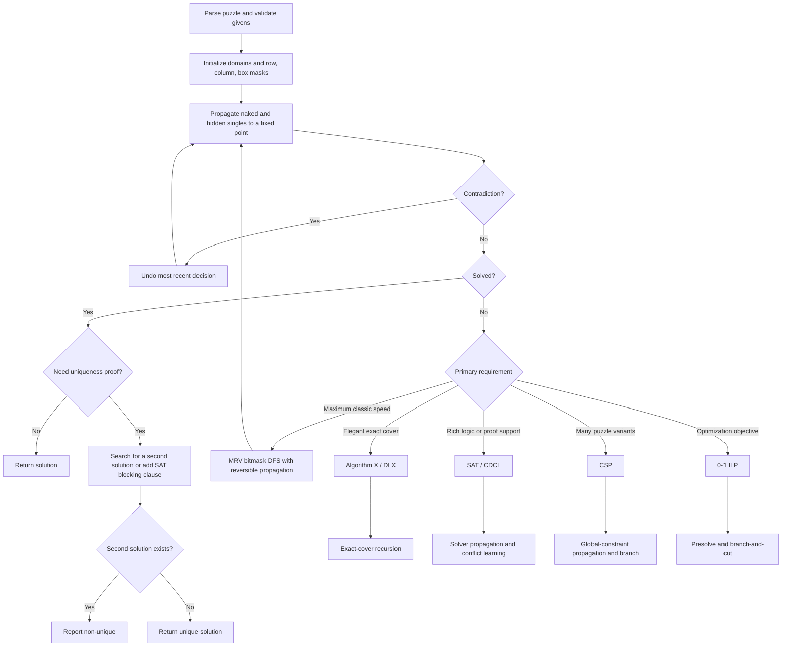

# Strategies for Solving Sudoku Puzzles: Human Logic, Mathematical Structure, and Algorithms

## Executive summary

Sudoku is a particularly clean example of the same underlying problem viewed through three lenses. For a human, it is a hierarchy of logical eliminations. For a mathematician, it is a highly structured Latin-square, symmetry, graph-coloring, and constraint-satisfaction object. For a programmer, it is a small but nontrivial exact-search problem that can be attacked effectively by constraint propagation, backtracking, exact cover, SAT, constraint programming, integer programming, or local search. These viewpoints are not competing explanations. Most successful techniques exploit the same fact: every candidate participates simultaneously in row, column, and box constraints, so deductions that reduce one domain propagate into several others.

For **human solving**, the highest-value discipline is not memorizing exotic pattern names but maintaining accurate candidates and repeatedly applying techniques from cheap and local to expensive and global. Singles and scanning come first. Locked candidates and subsets follow. Fish and wings become useful when local techniques stall. Coloring and alternating-inference chains provide a more general language that subsumes many named patterns. Uniqueness arguments are powerful but depend on the additional premise that the puzzle was constructed to have exactly one solution. Controlled contradiction tests such as Nishio and, finally, explicit branching can solve positions beyond the reach of a solver's preferred purely logical repertoire. Contemporary technique taxonomies differ somewhat in names and difficulty levels, especially for advanced chains, but the core families are broadly stable.

For **mathematics**, the classical 9×9 completed grid is an order-9 Latin square with nine additional 3×3 region constraints. Felgenhauer and Jarvis counted exactly

\[
6{,}670{,}903{,}752{,}021{,}072{,}936{,}960
\]

completed classical Sudoku grids. Russell and Jarvis subsequently found

\[
5{,}472{,}730{,}538
\]

essentially different grids after quotienting by the usual validity-preserving symmetries. These symmetries are naturally described by permutation groups and Burnside-style orbit counting.

Sudoku also admits particularly direct **CSP and graph formulations**. One can assign one variable with domain \(\{1,\ldots,9\}\) to each of 81 cells and impose 27 all-different constraints, or construct an 81-vertex graph in which two cells are adjacent exactly when they share a row, column, or box, then ask for a proper 9-coloring extending the clues. Generalized Sudoku is computationally hard. Yato and Seta proved ASP-completeness for Number Place, which implies NP-completeness of the associated generalized problem. This asymptotic statement concerns scalable \(n^2\times n^2\) Sudoku families, not the single fixed finite universe of 9×9 instances.

For **software**, the best general-purpose classical 9×9 architecture is usually a bitmask-based constraint engine with aggressive propagation, minimum-remaining-values branching, and reversible updates. Peter Norvig's compact constraint-propagation plus MRV search illustrates how dramatically propagation shrinks the tree: his 95-puzzle hard set required an average of only 64 possibilities to be considered, despite a raw combinatorial space that would otherwise be astronomical. Modern highly optimized solvers can go much further. On the Player's Forum Hardest 376-puzzle benchmark, several compiled solvers reported roughly 138 to 157 microseconds per puzzle and about 272 to 366 guesses per puzzle on the published benchmark machine/configurations. Those figures should be treated as implementation-specific measurements, not universal constants.

There is no single universally best algorithm. **DLX** is exceptionally elegant for exact cover. **Bitmask DFS with propagation** is simple, tiny, and extremely fast. **SAT** excels when proof machinery, conflict learning, or logical extensions matter. **CSP** is especially attractive for Sudoku variants and expressive global constraints. **Integer programming** integrates naturally with optimization objectives. **Local search** is interesting for experimentation and large generalized instances, but is less attractive when a guaranteed solution or uniqueness proof is required. Knuth's Dancing Links, Lynce and Ouaknine's SAT work, and modern benchmark studies illustrate these different design points.

## Human solving techniques

A useful notation standard is `rNcM` for row \(N\), column \(M\), with boxes `b1` through `b9` read left-to-right and top-to-bottom. Thus `r4c7=8` means place 8 in row 4 column 7, while `r4c7<>8` means eliminate 8. Candidate sets can be written `r4c7{238}`. For chains, a widespread convention uses `=` for a strong link and `-` for a weak link. HoDoKu's AIC notation, for example, writes candidates in parentheses followed by their cells. Terminology at the advanced end is not perfectly standardized, so notation should always be stated explicitly.

The examples below are **candidate-state snapshots of an ordinary 9×9 Sudoku**. Cells not mentioned can contain whatever candidates are consistent with the stated position. This is more useful pedagogically than embedding each technique in a different full puzzle, because it isolates the exact logical condition that licenses the deduction.

| Technique | Definition and when to use it | Step-by-step 9×9 example | Approximate level and common notation |
| --- | --- | --- | --- |
| **Scanning** | Systematically inspect a digit across rows, columns, boxes, or inspect a nearly completed house for its missing digits. It is the first pass because it requires little or no full pencilmarking. Contemporary teaching systems place this among the elementary methods. | Suppose row 1 is missing `{2,5}` at `r1c4` and `r1c7`. Column 4 already contains 2, so remove 2 from `r1c4`. Therefore `r1c4=5`, after which `r1c7=2`. Rescan the affected column, box, and row immediately. | **Beginner.** `r1c4=5`, `r1c7=2`. |
| **Cross-hatching** | For one digit, use already placed copies in intersecting rows and columns to cross out cells of a 3×3 box. The term is sometimes used broadly for hidden-single scanning, so nomenclature varies. | Consider digit 6 in `b1`. Existing 6s elsewhere eliminate all cells of rows 1 and 3 in that box, and existing 6s in columns 1 and 2 eliminate `r2c1,r2c2`. Only `r2c3` remains. Therefore `r2c3=6`. | **Beginner.** Often drawn by visually extending row/column lines through a box. |
| **Naked single** | A cell has exactly one candidate after peer eliminations. It is a property of one cell, not of a house. | If `r8c2{4}`, place `r8c2=4`. Delete 4 from all unsolved peers in row 8, column 2, and its box. Those deletions may create more singles. | **Beginner.** `{4} -> =4`. |
| **Hidden single** | Within one row, column, or box, a digit occurs in only one candidate position, even if that cell has several candidates. Some instructional sources associate this directly with cross-hatching. | In row 4 suppose candidate 7 occurs only in `r4c1{2,7}`, while every other unsolved cell in the row lacks 7. The uniqueness of 7's position in the **house** forces `r4c1=7`, even though the cell was not a naked single. | **Beginner.** “7 only at `r4c1` in r4.” |
| **Naked pair, triple, quad** | A naked \(k\)-subset occurs when \(k\) cells in one house collectively contain candidates from exactly \(k\) digits. Those \(k\) digits must occupy those cells, so they can be deleted elsewhere in the house. Naked pairs are the most common. | **Pair:** in row 2, `r2c2{3,8}` and `r2c8{3,8}` reserve 3 and 8, so delete 3 and 8 elsewhere in row 2. **Triple:** `r5c1{1,4}`, `r5c4{1,7}`, `r5c9{4,7}` have union `{1,4,7}`, so delete 1,4,7 from other row-5 cells. **Quad:** `r7c1{1,2}`, `r7c3{2,3}`, `r7c6{3,4}`, `r7c8{1,4}` reserve `{1,2,3,4}`. | **Easy to intermediate.** Often written `NP(38) r2c28`; triples and quads analogously. |
| **Hidden pair, triple, quad** | A hidden \(k\)-subset occurs when \(k\) digits can appear only in the same \(k\) cells of a house. Other candidates in those cells can be deleted. It is dual to a naked subset. | **Pair:** suppose digits 2 and 5 occur in row 3 only at `r3c2{2,5,8}` and `r3c7{1,2,5}`. Delete 8 from the first and 1 from the second, leaving `{2,5}` in both. **Triple:** if 1,4,9 occur in row 6 only at `c2,c5,c8`, remove every non-`{1,4,9}` candidate from those three cells. The same definition extends to four digits/four cells. | **Intermediate.** `HP(25) r3c27`, `HT(149)r6c258`. |
| **Pointing pair or triple** | In a box, if all candidates for a digit lie in a single row or single column, that digit must occur there inside the box. It can therefore be deleted from the remainder of that row or column outside the box. This is one form of locked candidate. | In `b1`, suppose the only 6s are `r2c1` and `r2c3`. One of them is 6, so row 2 obtains its 6 inside `b1`. Delete candidate 6 from `r2c4` through `r2c9`. A three-cell version is identical logically. | **Easy to intermediate.** `LC pointing: 6 b1 -> r2`; eliminations `r2c4<>6`, etc. |
| **Box-line reduction, or claiming** | The converse locked-candidate pattern. If all candidates for a digit in a row or column fall inside one box, that box must receive the digit on that line, so the digit can be deleted from other cells of the box. | In row 6 suppose candidate 4 occurs only at `r6c4,r6c5`, both in `b5`. Therefore 4 must occur in `b5` on row 6. Delete 4 from every other unsolved cell in `b5`. | **Easy to intermediate.** `LC claiming: 4 r6 -> b5`. |
| **X-Wing** | For one digit, if two rows restrict that digit to the same two columns, those four cells form a 2-by-2 fish. The digit must occupy opposite corners, so it can be eliminated from the two columns outside the base rows. The row/column roles can be reversed. | For digit 7, suppose row 2 has 7 only at `c3,c8` and row 7 also has 7 only at `c3,c8`. Whichever way the two 7s are arranged, columns 3 and 8 receive their 7 from rows 2 and 7. Delete 7 from all other cells of columns 3 and 8. | **Advanced.** `X-Wing 7 r27/c38`. |
| **Swordfish** | A size-3 fish. In three base rows, all candidates for a digit lie within the same three cover columns. Those columns' copies of the digit must come from the three base rows, allowing eliminations elsewhere in the cover columns. | For digit 4: `r1 -> c2,c6`; `r4 -> c2,c9`; `r8 -> c6,c9`. Across these three rows, every 4 lies in columns `{2,6,9}`. Delete candidate 4 from columns 2, 6 and 9 in all rows other than 1, 4 and 8. | **Advanced to expert.** `Swordfish 4 r148/c269`. |
| **Jellyfish** | A size-4 fish. Four base houses restrict one digit to four cover houses. In standard 9×9 solving it is the usual next basic fish after X-Wing and Swordfish. | For digit 6 suppose `r1 -> c1,c4`, `r3 -> c4,c7`, `r6 -> c1,c9`, `r8 -> c7,c9`. The four base rows use only cover columns `{1,4,7,9}`. Delete 6 from those four columns in every other row. | **Expert.** `Jellyfish 6 r1368/c1479`. |
| **XY-Wing, often Y-Wing** | Three bivalue cells use three digits. A pivot `{X,Y}` sees wing `{X,Z}` and wing `{Y,Z}`. Whichever pivot value is true, one wing is forced to Z, so cells seeing both wings cannot be Z. This can be viewed as a short implication chain. | Let pivot `r4c4{2,7}`, wing A `r4c9{2,5}`, wing B `r8c4{7,5}`. If pivot is 2, wing A becomes 5. If pivot is 7, wing B becomes 5. Thus one wing is 5 in either case. `r8c9` sees both wings, so `r8c9<>5`. | **Advanced.** `XY-Wing p=r4c4, wings=r4c9,r8c4; -5 r8c9`. |
| **XYZ-Wing** | The pivot has three candidates `{X,Y,Z}` and sees two bivalue wings containing subsets such as `{X,Z}` and `{Y,Z}`. Candidate Z is present in the pivot and both wings. A cell seeing all three cannot be Z. | `r4c4{2,5,7}` is the pivot, `r4c5{2,5}` and `r5c4{5,7}` are wings. If the pivot is 5, the target cannot be 5 directly. If it is 2, the `{5,7}` wing becomes 5; if it is 7, the `{2,5}` wing becomes 5. Hence `r5c5`, which sees all three cells, cannot contain 5. | **Advanced to expert.** `XYZ-Wing (257), -5 r5c5`. |
| **Simple coloring** | Follow strong links for one digit, alternately assigning two colors to conjugate candidates. Either one color class is true and the other false along each connected component. Two principal eliminations arise: a color that contradicts itself is false, or an uncolored candidate that sees both colors is false. | For digit 9 let the strong-link chain be `r2c2 = r2c8 = r7c8 = r7c4`, colored alternately A, B, A, B. Candidate `r7c2` sees A at `r2c2` through column 2 and B at `r7c4` through row 7. Whichever color is true, `r7c2` cannot be 9. Eliminate it. | **Advanced.** Solvers often color conjugate pairs with two colors or labels A/B. |
| **X-Chains, XY-Chains, AICs and forcing chains** | Chains express implications through alternating strong and weak links. A strong link means the linked propositions cannot both be false. A weak link means they cannot both be true. X-Chains use one digit; XY-Chains use bivalue cells; AIC is a general alternating-inference language. Forcing chains deliberately branch assumptions and look for a common consequence or contradiction. | A representative AIC can establish that one of two endpoint 5s must be true, such as a chain beginning at candidate 5 in `r1c2` and ending at candidate 5 in `r8c3`. Any candidate 5 that sees **both** endpoints can then be removed. In notation, links alternate strong `=` and weak `-`; the solver checks each implication in sequence rather than treating the visual pattern as a magical object. | **Expert to extreme.** AIC notation commonly resembles `(a=b)rNcM-(b=c)rPcQ...`. HoDoKu explicitly uses `-` for weak and `=` for strong links. |
| **Uniqueness tests** | These exploit an extra premise: the published puzzle is known to have exactly one solution. The best-known example is the Unique Rectangle, which prevents an unresolved two-digit rectangle from supporting two interchangeable completions. BUG+1 is another uniqueness-based pattern. These are not consequences of row/column/box rules alone. | Let `r1c1`, `r1c4`, and `r2c1` all be `{3,8}`, while `r2c4{3,6,8}`. The four cells occupy two rows, two columns and two boxes. If `r2c4` were restricted to 3 or 8, the rectangle could support the two swapped 3/8 completions. Assuming uniqueness, eliminate 3 and 8 from `r2c4`, yielding `r2c4=6`. | **Expert.** `UR Type 1 (38) r12c14`; usually annotate the “extra” candidate in the fourth corner. |
| **Nishio** | A contradiction-based candidate test. Assume a candidate, propagate its consequences, and reject it if the assumption makes a cell, house, or candidate impossible. The exact scope associated with the name “Nishio” varies across solving communities, so it is best understood as structured contradiction testing rather than as one geometrical pattern. | Suppose `r6c6{2,7}`. Temporarily set `r6c6=2`. Propagation may force a sequence of singles and eventually remove every possible 7 from row 9. Since row 9 must contain 7, the branch is impossible. Undo the temporary branch and eliminate 2 from `r6c6`, forcing 7. | **Expert / last resort.** `Assume r6c6=2 -> contradiction -> r6c6<>2`. |
| **Trial-and-error or hand backtracking** | Explicitly branch on a candidate, preserve a checkpoint, propagate, and recursively continue until the branch succeeds or contradicts the rules. This is mathematically legitimate search, although some human-solving traditions exclude it from “logical” solving. It is exactly the hand analogue of depth-first backtracking. | At `r5c5{2,6}`, mark branch A: `r5c5=2`. Propagate every forced consequence. If contradiction occurs, restore the checkpoint and take branch B: `r5c5=6`. For nested branching, label decisions A1, A2, B1, and retain a clean candidate snapshot before each decision. | **Last resort.** Tree notation, assumption labels, or separate pencil colors are useful. |

A candidate-map view makes the fish logic more transparent. In this schematic **X-Wing for digit 7**, `*` marks the four wing corners and `x` marks 7-candidates that can be eliminated:

```text
       c1 c2 c3 c4 c5 c6 c7 c8 c9
r1      .  .  x  .  .  .  .  x  .
r2      .  .  *  .  .  .  .  *  .
r3      .  .  x  .  .  .  .  .  .
r4      .  .  .  .  .  .  .  x  .
r5      .  .  x  .  .  .  .  x  .
r6      .  .  .  .  .  .  .  .  .
r7      .  .  *  .  .  .  .  *  .
r8      .  .  x  .  .  .  .  x  .
r9      .  .  .  .  .  .  .  x  .

Base rows:  r2, r7
Cover cols: c3, c8
Result: eliminate every x in c3 and c8.
```

X-Wing, Swordfish and Jellyfish are therefore not three unrelated tricks. They are size-2, size-3, and size-4 instances of the same fish construction. Finned and sashimi fish extend this framework when one or more candidates lie just outside the clean base-cover pattern. Modern advanced-solving catalogues also commonly include Skyscraper, Two-String Kite, Empty Rectangle, W-Wing, Remote Pair, finned fish, XY-Chains, 3D Medusa, Almost Locked Sets, and increasingly general AICs.

## Human workflow, notation, and visualization

The most reliable human strategy is a **fixed-point workflow**. Do not use an advanced technique merely because it is available. Use the cheapest deductions repeatedly until none remains, because every placement can destroy the need for a difficult pattern.

**First pass.** Scan every row, column, and box for completed or nearly completed houses, cross-hatched placements, naked singles, and hidden singles. After every placement, immediately rescan its three affected houses. Then perform a digit-by-digit scan from 1 through 9 looking for locked candidates. Basic technique systems consistently put singles and locked-candidate work before fish and chains.

**Second pass.** Complete accurate pencilmarks and search houses for naked and hidden pairs, triples, and quads. Locked candidates and subsets interact strongly. For example, a pointing elimination may create a naked pair, which may reveal a hidden single. The important operational principle is therefore “deduce, propagate, restart from cheap methods,” rather than “finish every pattern of one type before moving on.”

**Third pass.** Build candidate maps one digit at a time. Look first for conjugate pairs and size-2 structures: X-Wings, Skyscrapers, Two-String Kites, short X-Chains, and simple coloring. Only then invest visual effort in Swordfish or Jellyfish. Fish are easiest to recognize when the board is viewed as nine binary candidate maps rather than as one dense collection of pencilmarks.

**Fourth pass.** Search bivalue-cell geometry for XY-Wings, XYZ-Wings, W-Wings, and XY-Chains. At very high difficulty, stop thinking primarily in terms of named pictures and move to strong/weak-link reasoning. An AIC provides a unifying framework in which many short named patterns become recognizable special cases. HoDoKu explicitly describes chains as implication streams built from strong and weak links, and notes that their nomenclature has historically been less uniform than basic Sudoku terminology.

**Fifth pass.** If the puzzle is guaranteed unique, inspect Unique Rectangles and related uniqueness patterns. If the solving rules permit contradiction techniques, try a tightly constrained Nishio test. Only after that should a human solver who wishes to minimize guessing branch explicitly. When branching, choose a cell with two candidates or another highly constrained proposition, which is the human analogue of minimum remaining values. MRV is highly effective in computer search for exactly the same reason: it tends to expose a contradiction with a small branching factor.

A practical annotation system should distinguish **facts, possibilities, relationships, and temporary assumptions**. Write givens and proved placements as large digits. Keep candidates in consistent 3×3 micropositions inside cells, where candidate 1 occupies the upper-left microposition and 9 the lower-right. When studying one digit, highlight all of its candidates and visually suppress the rest. For advanced work, draw strong links as solid lines and weak links as dashed lines. This parallels HoDoKu's visualization and reduces the chance of confusing “exactly one of these must be true” with the weaker “these two cannot both be true.”

For speculative work, use a visibly different convention. Circled candidate or color A can mean a branch assumption, while boxed digits remain logically proved. Never silently mix assumptions with deductions. A compact search trace can look like this:

```text
checkpoint S0
|
+-- A: r6c6 = 2
|      -> r6c2 = 5
|      -> r9c2 <> 5
|      -> ...
|      -> row 9 has no candidate for 7
|      -> CONTRADICTION
|
+-- therefore r6c6 <> 2
       -> r6c6 = 7
       -> resume ordinary logic
```

This is the same fundamental control structure as a computer's recursive backtracker. The difference is that a human should normally exhaust high-yield deterministic consequences before creating a branch. Norvig's solver demonstrates quantitatively why this matters. Constraint propagation can remove huge portions of the hypothetical search space after a single trial assignment.

## Mathematical theory

A completed classical Sudoku grid is a **Latin square of order 9 with extra regional restrictions**. Every row and every column contains each symbol exactly once, as in a Latin square, but Sudoku additionally requires every designated 3×3 box to contain each symbol exactly once. Felgenhauer and Jarvis explicitly used the Latin-square viewpoint in their enumeration search, including a shortest-remaining-row-or-column idea to reduce branching.

The exact number of completed grids is one of the best-known results in Sudoku mathematics:

\[
N =
6{,}670{,}903{,}752{,}021{,}072{,}936{,}960
\approx 6.671\times10^{21}.
\]

Felgenhauer and Jarvis obtained this by canonicalizing part of the grid, exploiting relabelings and structural equivalences, and enumerating remaining completions with computer assistance. Their paper notes that fixing the upper-left block canonically removes a factor of \(9!\), then uses further row, column, and block equivalences to shrink the computation. They also independently checked key parts of the calculation.

The enormous raw count includes grids that are the “same” under Sudoku-preserving transformations. The principal positional transformations include permutation of the three row bands, permutations of rows within each band, the analogous stack and within-stack column permutations, and transposition. The positional rearrangement group has

\[
2(3!)^8 = 3{,}359{,}232
\]

elements. Independent relabeling of the nine symbols contributes a \(9!\) action. Rotations and reflections are contained within the group generated by the structural row/column operations and transposition. Russell and Jarvis's symmetry computation gives exactly **5,472,730,538 essentially different completed grids**.

The reason one cannot simply divide the total number of grids by one universal symmetry factor is that some grids have nontrivial stabilizers. In group-action terminology, different grids can have different orbit sizes. Russell and Jarvis therefore organized transformations into conjugacy classes and counted fixed points, an application of the same principle formalized by Burnside's lemma. Their calculation is a particularly concrete example of permutation-group methods turning a brute-force classification into an orbit-counting problem.

The standard **constraint-satisfaction formulation** is simpler. Introduce 81 variables

\[
X_{r,c}\in\{1,\ldots,9\},
\]

fix the clue variables, then impose an `AllDifferent` constraint on each of 9 rows, 9 columns, and 9 boxes. Thus the classical model has 27 principal all-different constraints. Each cell belongs to three units and has 20 distinct peers after overlaps are removed. Constraint propagation repeatedly reduces domains, while search handles whichever ambiguity survives. Norvig's implementation is an especially clear operational demonstration of this representation.

The equivalent **graph-coloring formulation** has one vertex for every cell. Two vertices are adjacent when their cells share a row, column, or box. A completed Sudoku is then a proper 9-coloring, with the givens precoloring some vertices. Herzberg and Murty developed the Sudoku-graph viewpoint in connection with chromatic polynomials, making graph theory another natural mathematical language for the puzzle.

There is also a useful Boolean formulation. Let \(x_{r,c,d}\) mean “cell \((r,c)\) contains digit \(d\).” There are \(9^3=729\) such propositions. The Sudoku rules become families of exactly-one constraints for cells, row-digit combinations, column-digit combinations, and box-digit combinations. This Boolean model underlies both SAT encodings and exact-cover formulations. Lynce and Ouaknine compared a minimal CNF encoding with an extended encoding containing redundant clauses, and found that the stronger redundant formulation allowed unit propagation alone to solve roughly half of their very hard test set.

**Computational complexity requires an important qualification.** Yato and Seta proved ASP-completeness for Number Place, implying NP-completeness. Complexity theory here refers to the generalized family whose dimensions grow, typically \(n^2\times n^2\) boards divided into \(n\times n\) regions. A fixed 9×9 Sudoku universe is finite, so calling the one fixed board size “NP-complete” without this qualification is conceptually misleading. The hardness result explains why one should expect exponential worst cases in generalized complete solvers even though ordinary 9×9 puzzles are tiny in practice.

An adjacent extremal result is the **minimum-clue problem**. McGuire, Tugemann, and Civario gave a computer-assisted exhaustive proof that no uniquely solvable classical Sudoku puzzle can have only 16 clues. Since 17-clue examples were already known, 17 is therefore the global minimum number of givens for a uniquely solvable standard 9×9 puzzle. This should not be confused with difficulty. Modern benchmark analysis finds many 17-clue puzzles algorithmically easy, and about half of the complete 17-clue collection can be finished with only naked and hidden singles.

**Number theory is not fundamental to classical Sudoku.** The symbols happen to be written as integers 1 through 9, but their arithmetic values are irrelevant. An arbitrary permutation of the nine symbols preserves validity, which is exactly why digit relabeling contributes a \(9!\) symmetry factor in enumeration. One could replace 1 through 9 with nine letters without changing the mathematical puzzle. There are interesting algebraic, coding-theoretic, design-theoretic, and combinatorial connections around Sudoku, but ordinary arithmetic or deep number-theoretic properties of the integers do not drive the classical rules. This conclusion follows directly from the relabeling symmetry and the Latin-square/CSP/graph formulations.

## Algorithmic and programmatic solving

The central engineering distinction is between **propagation** and **search**. Propagation computes consequences that are logically forced by the current partial assignment. Search selects a still-ambiguous choice and temporarily commits to one alternative. The strongest practical solvers interleave the two. Search without propagation produces enormous trees; propagation without search cannot guarantee completion of arbitrary instances unless increasingly sophisticated reasoning is added. Norvig's measurements show this interaction directly. On his 95 hard puzzles, only 64 possibilities on average needed explicit consideration after propagation.

**Backtracking with MRV, forward checking, and propagation.** Maintain a domain for every unsolved cell. Whenever a digit is assigned, remove it from its peers. If a domain becomes empty, backtrack immediately. If a domain becomes singleton, propagate the assignment. Hidden singles can be propagated by tracking, for each house-digit pair, how many candidate cells remain. When deterministic propagation reaches a fixed point, choose an ambiguous cell with the **minimum remaining values**. Norvig uses exactly this MRV rule, and the T-Doku performance study shows how dramatically candidate-based variable ordering can reduce guessing. In one benchmark, adding a most-constrained-cell heuristic cut the basic solver's guesses from roughly 1.37 million to 647 per puzzle and improved runtime from about 33.8 ms to 1.33 ms on Magic Tour Top 1465.

```text
SEARCH(state):
    if PROPAGATE(state) detects contradiction:
        return failure
    if every cell is assigned:
        return state

    cell := unassigned cell with minimum domain size

    for digit in ORDER_VALUES(cell):
        checkpoint := save reversible state
        assign cell = digit

        result := SEARCH(state)
        if result succeeds:
            return result

        restore checkpoint

    return failure
```

Useful refinements include least-constraining-value ordering, immediate detection of zero-candidate cells, hidden-single propagation, queue-based propagation instead of repeatedly scanning the whole grid, reversible trails rather than copying the board, and branch ordering based on candidate impact. Generalized worst-case running time remains exponential because generalized Sudoku is NP-complete, but 9×9 behavior is overwhelmingly determined by how much pruning occurs before and immediately after each branch.

**Algorithm X and Dancing Links.** Sudoku maps almost perfectly to Knuth's exact-cover framework. Construct one potential row for each candidate assignment \((r,c,d)\), giving \(9^3=729\) rows before clues are applied. Construct 324 exact-cover columns, consisting of 81 cell constraints, 81 row-digit constraints, 81 column-digit constraints, and 81 box-digit constraints. Each candidate assignment satisfies exactly four constraints, so the unpruned sparse matrix contains only \(729\times4=2,916\) ones. Algorithm X recursively selects a constraint column, chooses one candidate row satisfying it, removes every incompatible row, and backtracks. Knuth's Dancing Links, or DLX, implements deletion and restoration through reversible operations on circular doubly linked lists.

```text
DLX_SEARCH(partial_solution):
    if no uncovered constraint columns remain:
        report partial_solution
        return

    c := uncovered column having the fewest rows
    COVER(c)

    for each row r still present in c:
        append r to partial_solution

        for each other node j in row r:
            COVER(column(j))

        DLX_SEARCH(partial_solution)

        for each node j in row r, in reverse order:
            UNCOVER(column(j))

        remove r from partial_solution

    UNCOVER(c)
```

DLX is attractive because it is conceptually elegant, complete, and needs no Sudoku-specific higher logic after the encoding. Choosing the smallest column is the exact-cover analogue of MRV. Its main cost relative to a specialized bitmask solver is representation overhead. A 9×9 Sudoku can be represented in a handful of machine words, whereas DLX maintains linked nodes and column metadata. For enumeration, finding all solutions, testing uniqueness, and teaching exact cover, that tradeoff is often worthwhile. Knuth's original Dancing Links paper emphasizes the value of reversible local updates during depth-first combinatorial search.

**SAT and CDCL.** Define \(x_{r,c,d}\) as above and encode exactly-one conditions as CNF. At minimum each cell needs an at-least-one clause, while exclusion clauses and analogous row, column, and box rules ensure validity. Modern SAT solvers then add unit propagation, conflict analysis, learned clauses, nonchronological backtracking, variable-activity heuristics, and restarts. Lynce and Ouaknine's Sudoku study is particularly instructive because it shows that logically redundant clauses can greatly strengthen propagation. The best encoding is not necessarily the syntactically smallest one.

```text
SAT_SOLVE(puzzle):
    F := Sudoku-rule CNF

    for each clue (r,c)=d:
        add unit clause x[r,c,d] to F

    result := CDCL(F)

    if UNSAT:
        return "no solution"

    solution := decode(result.model)

    # Optional uniqueness check:
    B := OR over all solved cells of NOT x[r,c,solution[r,c]]
    result2 := CDCL(F AND B)

    if result2 == UNSAT:
        return solution, "unique"
    else:
        return solution, "multiple solutions"
```

The blocking-clause technique makes SAT especially convenient for uniqueness testing. SAT also becomes attractive when Sudoku is embedded in a larger logical system, when machine-checkable proof traces matter, or when constraints change frequently. The memory footprint is larger than a hand-optimized bitmask DFS because the solver retains clauses, watches, implication information, and learned constraints, but those structures are precisely what make CDCL powerful on harder generalized constraint systems. Lynce and Ouaknine demonstrate that even basic SAT inference has substantial strength on Sudoku when the encoding exposes enough structure.

**Constraint programming.** A CSP implementation stays close to the mathematical statement of the puzzle. Create 81 finite-domain integer variables and 27 `AllDifferent` constraints. A CP solver propagates domain reductions through these global constraints and branches when propagation stalls. Unlike a hand-written classical solver, the same framework can absorb diagonal constraints, irregular regions, cages, inequalities, thermometers, or other variant rules with relatively little architectural change.

```text
for r,c:
    X[r,c] in 1..9

for each row r:
    AllDifferent(X[r,1..9])

for each column c:
    AllDifferent(X[1..9,c])

for each 3x3 box b:
    AllDifferent(X[cells of b])

for each clue (r,c,d):
    X[r,c] = d

PROPAGATE()
while not solved:
    v := MRV variable
    branch on values of v
```

For classical 9×9 alone, a bespoke bitmask solver usually has lower constant overhead. CP becomes more attractive as the constraint language grows, because the programmer can delegate propagation algorithms and branching machinery to the solver rather than reimplementing every variant. The CSP interpretation also gives the clean conceptual bridge from human pencilmarks, which are domains, to automated propagation.

**Binary integer programming.** Introduce binary variables

\[
x_{r,c,d}\in\{0,1\},
\]

where \(x_{r,c,d}=1\) exactly when digit \(d\) occupies cell \((r,c)\). The core linear model is

\[
\sum_d x_{r,c,d}=1
\]

for each cell,

\[
\sum_c x_{r,c,d}=1
\]

for every row-digit pair,

\[
\sum_r x_{r,c,d}=1
\]

for every column-digit pair, and

\[
\sum_{(r,c)\in b}x_{r,c,d}=1
\]

for every box-digit pair. A clue simply fixes one variable to 1. There are 729 binary variables and 324 core equality constraints before the clues. Standard mixed-integer solvers can treat the problem as pure feasibility with objective 0, using presolve, branching, cutting planes, and propagation. Official mathematical-programming examples use precisely this kind of binary formulation.

```text
MODEL:
    binary x[r,c,d]

    impose four families of exactly-one equalities
    fix clue variables to 1
    objective := 0

SOLVE using MILP branch-and-bound / branch-and-cut
```

Integer programming is excessive if the sole aim is to solve one ordinary Sudoku as fast as possible. It becomes more compelling when Sudoku is one component of a larger optimization model, or when one wishes to optimize clue placement, penalties, symmetry requirements, or other numerical objectives together with the logical constraints.

**Stochastic and local search.** A useful simulated-annealing representation initially fills each box with a permutation of its missing digits, thereby preserving box validity automatically. The objective counts row and column conflicts. A move swaps two non-given entries within one box. Hill climbing accepts only improving moves; simulated annealing occasionally accepts a worsening move with probability related to \(\exp(-\Delta/T)\), which can help escape local minima. A SAT encoding also permits generic local-search algorithms such as GSAT or its descendants, which repeatedly flip assignments chosen to reduce unsatisfied clauses. GSAT originated as a greedy local-search procedure for SAT rather than as a Sudoku-specific algorithm.

```text
LOCAL_SEARCH():
    state := random box-valid completion
    T := initial_temperature

    repeat until limit:
        if row_conflicts(state) + col_conflicts(state) == 0:
            return state

        move := swap two mutable cells in one box
        delta := change in conflict score

        if delta <= 0 or random() < exp(-delta / T):
            apply move

        T := COOL(T)

        if stagnating:
            restart from another random completion

    return failure
```

The attraction is low memory, easy parallel restarts, and no recursive tree. The drawback is fundamental: ordinary local search is generally not a proof procedure. A failure to find a completion does not prove none exists, and finding one solution does not establish uniqueness. For proper newspaper-style 9×9 Sudoku, where a complete solver and uniqueness verification are usually desired, exact methods are therefore preferable. GSAT's original work illustrates the broader strength of stochastic SAT search, but Sudoku's tiny structured instances make deterministic propagation plus exact search unusually competitive.

**Optimized bitmask solving.** For classical 9×9, this is often the performance-oriented sweet spot. Keep three arrays `row_used[9]`, `col_used[9]`, and `box_used[9]`, with one bit for each digit. With

\[
\text{FULL}=2^9-1=511,
\]

the candidate mask for cell \((r,c)\) is

\[
\text{FULL}\ \&\ \sim(\text{row}[r]\;|\;\text{col}[c]\;|\;\text{box}[b]).
\]

Population-count instructions identify MRV cells, and low-bit extraction iterates candidate digits efficiently. More sophisticated solvers maintain additional incidence masks and propagate consequences in parallel. The T-Doku benchmark work shows that highly optimized representation plus stronger inference can reduce both instruction count and backtracking dramatically.

```text
BITMASK_DFS():
    propagate singles and contradictions

    if solved:
        return true

    cell := cell with minimum popcount(candidate_mask)
    mask := candidate_mask[cell]

    while mask != 0:
        bit := mask & -mask
        mask -= bit

        save reversible trail
        place(bit, cell)

        if BITMASK_DFS():
            return true

        undo trail

    return false
```

The recommended architecture for a fast, robust general solver is therefore:



This architecture reflects an important practical principle. **Algorithm choice should follow the output requirement.** A speed benchmark wants bit-level specialization. A tutorial may prefer DLX because the reduction is beautiful. A puzzle generator needs efficient second-solution detection. A variant platform benefits from CP or SAT extensibility. An optimization study may naturally use ILP. No single implementation dominates all of these objectives.

## Benchmarks and comparative performance

Sudoku performance numbers are unusually easy to misuse. A microsecond figure depends on CPU generation, compiler, puzzle distribution, whether parsing is included, whether only the first solution or all solutions are required, and whether the solver has been specialized to the benchmark. “Nodes” are even less comparable. One solver counts guesses, another recursive calls, another SAT decisions/conflicts, and DLX may count selected exact-cover rows. Consequently, the table below gives measured anchors where comparable published data exist and explicitly says “not standardized” where pretending to have a universal average would be false precision.

| Approach | Typical runtime on 9×9 | Average nodes / explored states | Implementation complexity | Suitability for minimal / diabolical puzzles |
| --- | --- | --- | --- | --- |
| **Propagation + MRV DFS** | Norvig's historical Python implementation averaged **0.04 s** on his 95 hard puzzles. Hardware and implementation are dated, so treat this as an algorithmic reference point rather than a modern speed target. | **64 possibilities/puzzle on average** on Norvig's 95-hard collection; no puzzle searched more than 16 uncertain squares in that experiment. | Low to moderate | **Excellent.** Complete, simple, easy to augment with uniqueness testing. |
| **Basic DFS without strong ordering** | T-Doku's basic implementation needed about **20.1 ms/puzzle** on the 376-puzzle Forum Hardest 1106 set. | About **736,916 guesses/puzzle** on that benchmark. | Low | **Poor without heuristics.** Demonstrates why propagation and ordering matter. |
| **Algorithm X + DLX** | No single canonical cross-platform Sudoku runtime. The fixed matrix is tiny, and well-written implementations are comfortably suitable for interactive solving, but data structures and column heuristics materially affect speed. Knuth's work establishes DLX as an efficient reversible exact-cover search technique. | Not standardized. Usually measured as selected exact-cover rows or recursion calls, so direct comparison with “guesses” is misleading. | Moderate | **Excellent.** Particularly good for enumeration and uniqueness tests. |
| **SAT / CDCL** | No universal Sudoku figure because solver startup, encoding, and clause set can dominate such a small problem. Lynce and Ouaknine show that encoding strength changes inference performance substantially. | Decisions, propagations and conflicts replace conventional Sudoku nodes. Not directly comparable. | Moderate if using a library; high for writing a solver | **Excellent.** Strong for hard/generalized cases, proofs, and uniqueness via blocking clauses. |
| **CSP with global constraints** | Normally interactive on 9×9, but runtime is solver- and propagator-dependent; framework overhead dominates more than in a hand-coded bit solver. | Usually reported as branches/failures/propagations, not a universal node count. | Low with a CP framework | **Excellent**, particularly when variants add nonclassical constraints. |
| **0-1 ILP / MILP** | Highly solver-dependent. For a 729-binary-variable feasibility model, framework and presolve overhead can matter more than the underlying 9×9 search. | Branch-and-bound nodes are solver-dependent and can be zero after strong presolve on easy instances or nonzero on harder formulations. | Low to moderate with a modeling system | **Good**, but usually unnecessary for classical solving. Excellent when optimization is part of the problem. |
| **Simulated annealing / GSAT-style local search** | Variable. Successful runs may be rapid, but restarts and local minima create heavy variance; there is no deterministic finite-search guarantee for a plain local-search implementation. GSAT is explicitly a local-search SAT method. | Better measured in flips/swaps and restarts than search-tree nodes. | Low to moderate | **Conditional.** Interesting experimentally, weaker for guaranteed uniqueness or unsatisfiability proofs. |
| **Optimized bitmask / specialized exact search** | On the 376-puzzle Forum Hardest 1106 benchmark, published compiled solvers `sk_bforce2`, `fsss2`, and `jczsolve` measured about **138, 157, and 152 μs/puzzle**, respectively, on the reported setup. | Respectively about **272, 277, and 366 guesses/puzzle** on that set. | Moderate to very high | **Excellent.** Usually the best choice when classical 9×9 throughput is the primary objective. |

The T-Doku study also quantifies the value of one of the simplest heuristics. On Magic Tour Top 1465, its unsophisticated basic solver averaged about 1.37 million guesses and 33.8 ms per puzzle. Merely selecting the most constrained cell reduced that to about 647 guesses and 1.33 ms. The authors describe this as roughly a 25-fold speedup with roughly a 2,000-fold reduction in guessing. This is a striking empirical reminder that **variable ordering can matter more than low-level code optimization**.

The highest-value pruning mechanisms for exact solvers are therefore: early contradiction detection, MRV or smallest-column selection, immediate propagation of singleton domains, maintenance of house-digit availability counts, incremental rather than full-board recomputation, reversible trails, and value ordering that tends to expose contradictions quickly. SAT adds learned nogoods, nonchronological backtracking and restarts. DLX obtains extremely cheap undo operations through its linked structure. CP obtains stronger deductions from global constraints. Each is a different implementation of the same principle: **prove large families of choices impossible without enumerating them individually**.

For testing, a serious solver should use several distributions rather than one famous “hardest Sudoku.” T-Doku's benchmark collection documents a useful hierarchy. The **complete 17-clue collection contains 49,158 puzzles**. Magic Tour Top 1465 is an older hard benchmark. Player's Forum Hardest 1905 contains more than two million difficult puzzles, with a roughly 49,000-puzzle subset rated above 11 by Sudoku Explainer. Forum Hardest 1106 contains 376 puzzles that are especially severe for backtracking solvers. The project also supplies a one-million-puzzle sample of minimal Sudokus intended to be more representative than collections selected only for extremal difficulty.

Small regression suites remain useful. Norvig used Project Euler's 50-puzzle set, a 95-hard-puzzle collection, and a smaller “hardest” set. These are convenient for correctness tests and profiling but are far too small to support broad throughput claims by themselves. A robust evaluation should additionally include invalid grids, zero-solution instances, and multi-solution cases, because generators and uniqueness checkers encounter all three. T-Doku explicitly includes such datasets for this reason.

One benchmark lesson is counterintuitive. **Few clues do not necessarily mean hard.** In the 17-clue collection, T-Doku reports that about 45 percent can be completed using only naked and hidden singles, and only about 0.07 percent initially lack an immediate opportunity for progress by those elementary methods. Algorithmic difficulty depends much more strongly on the structure and sequencing of constraints than on clue count alone.

## Research directions and conclusions

Several classical questions are settled. The number of completed grids is known exactly. The number of essentially different grids under the standard symmetry group is known. The global minimum number of clues in a uniquely solvable standard puzzle is 17. Generalized Sudoku has a strong complexity-theoretic hardness result. Those achievements shift current mathematical interest away from the elementary questions “how many grids?” and “can 16 clues suffice?” toward finer structural, extremal, algorithmic, and explanatory questions.

One continuing area is the **minimum Sudoku clue problem for a specified completed grid**. The global existence of a 17-clue puzzle does not imply that every solution grid admits a 17-clue uniquely identifying subset. Given a particular completed grid, finding the smallest clue subset that uniquely determines it is a separate combinatorial optimization problem, naturally related to hitting sets and bilevel optimization. Recent work continues to investigate exact approaches to this per-grid minimization problem.

A related extremal direction asks how **many clues certain completed grids intrinsically require**. Recent 2026 work by Eppstein and Zhang studies Sudoku grids requiring many clues in both classical and generalized settings, including constructions of ordinary 9×9 grids whose minimum uniquely identifying clue sets have size 18 and asymptotic results for generalized grids. This complements the famous 17-clue lower-bound question by asking for the opposite sort of extremum.

A second rich area is **formal human difficulty**. Clue count is a poor proxy, and even labels such as “diabolical” depend strongly on which techniques a rating system recognizes and how expensive it considers them. A promising research program is to define a proof calculus of human-acceptable steps, assign empirically validated cognitive costs, and optimize either puzzle generation or solution proofs under that model. Work on generating puzzles solvable by specified strategies illustrates that this question can be formulated algorithmically rather than treated purely subjectively.

A third direction is **explainable automated solving**. A fast DFS solver can often produce the answer far more cheaply than it can produce a pleasant human explanation. The research challenge is therefore not just satisfiability, but finding a short, understandable proof in a chosen logic. This connects Sudoku to proof search, automated theorem proving, minimum explanation problems, and educational systems. AICs are relevant because they provide a relatively general implication language into which many named human patterns can be translated.

At the engineering end, opportunities remain in **SIMD/vectorized propagation, parallel enumeration, cache-friendly data structures, learned branch selection, proof logging, and heterogeneous solver portfolios**. T-Doku's benchmark study already demonstrates how dramatically representation, variable ordering and inference strength change performance on the same puzzle populations. Machine-learned heuristics could choose branch variables or inference families, but any claimed improvement should be tested against diverse distributions rather than one curated hardest list.

The foundational sources are unusually accessible. Felgenhauer and Jarvis's enumeration paper gives the exact \(6.67\times10^{21}\) grid count and describes the reductions used to obtain it. Russell and Jarvis's work provides the 5,472,730,538 symmetry classes. Yato and Seta provide the fundamental generalized complexity result. Knuth's *Dancing Links* gives the core DLX machinery. Lynce and Ouaknine analyze Sudoku-specific SAT encodings. Norvig provides an unusually transparent constraint-propagation and MRV implementation with empirical search statistics. McGuire, Tugemann, and Civario settle the 16-clue question. Together these sources connect recreational solving directly to combinatorics, permutation groups, computational complexity, constraint programming, and modern search.

The practical conclusion is correspondingly simple. A strong **human solver** should master candidate discipline and propagation first, subsets and locked candidates second, fish and wings third, and chains only after those tools are automatic. A strong **mathematical account** should treat Sudoku primarily as a constrained Latin-square and symmetry problem, not as arithmetic. A strong **software solver** should spend most of its sophistication on propagation, variable ordering, and cheap undo operations rather than on blind enumeration. Whether the final search engine is bitmask DFS, DLX, SAT, CSP, or ILP matters less than respecting that central principle. The fastest and the most elegant Sudoku methods all succeed by extracting as much consequence as possible from each constraint before making another choice.

## Related pages

- [Specifications](specifications.md)
- [`solver.allium`](../specs/solver.allium) — the verdict solver specified from the algorithmic half of this page.
- [`sudoku.allium`](../specs/sudoku.allium) — the rules every strategy here answers to.
